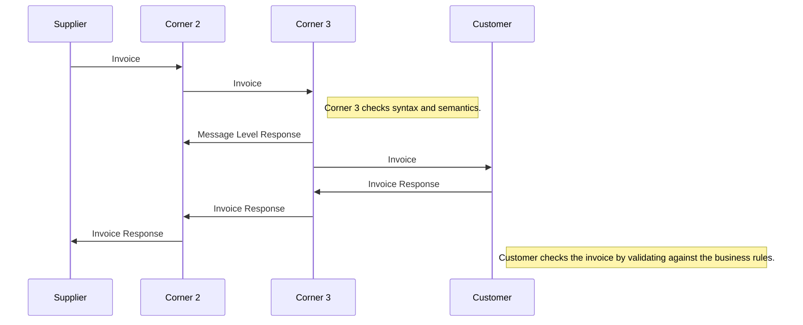
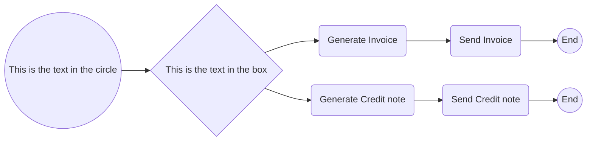
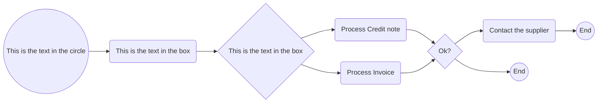

# Guideline for implementation of invoice to payment process
 

## Business process

 

 

 

### Invoice
The invoicing process includes issuing and sending the invoice and the credit note from the supplier to the customer and the reception and handling of the same at the customer’s site.

 

The invoicing process is shown in this work flow:

 

* A supplier issues and sends an invoice to a customer. The invoice refers to one order and a specification of delivered goods and services.

 

An invoice may also refer to a contract or a frame agreement. The invoice may specify articles (goods and services) with article number or article description.

 

* The customer receives the invoice and processes it in the invoice control system leading to one of the following results:
   * The customer fully approves the invoice, posts it in the accounting system and passes it on to be paid.
   * The customer completely rejects the invoice, contacts the supplier and requests a credit note.
   * The customer disputes parts of the invoice, contacts the supplier and requests a credit note and a new invoice.

 

The diagram below shows the basic invoicing process with the use of this PEPPOL BIS profile. This process assumes that both the invoice and the credit note are exchanged electronically.

 

 

### Transport acknowledgements
These are messages that are exchanged within the transport network(s) to inform about the process of carrying a message down the transport line. 
These responses may inform someone up-line that the delivery to a given point was successful or not and may contain details about issues that are relevant such as why a delivery was not successful. 
The key nature of these responses is that they do not in any way act on result of validation or processing of the content of the payload that is being transported. 
These response messages are commonly called “acks”.

 

### Message Level Responses
When a message has reached a given point in the transport line its content may be validated according to agreed specifications that may be both syntactical and semantic. 
The outcome of these validations may be reported to a relevant party up-line, informing him whether the validation was successful or not as well as giving some details. 
An example could be that an order message that is received is rejected because it is missing a closing tag (syntax error) or because its amounts don’t add up according to what is specified in the relevant syntax specification. 
A key nature of these messages is that they report on the message content on the basis of the technical specifications that apply.

 

### Invoice Responses
A message that has been received and accepted for processing may call for an action on the receiver’s behalf. 
That receiver’s action may need to be reported back up-line to a relevant party. 
An example is that a technically correct order may be received but the receiver decides to reject the order for any business reason such as out-of-stock situation, expired contract etc. 
The key nature of these responses is that they report a business decision that is made on the message instance received.