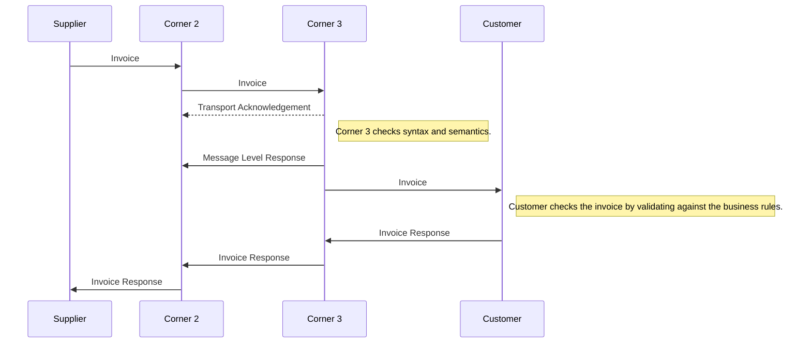
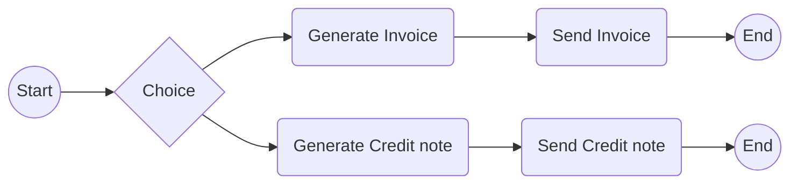
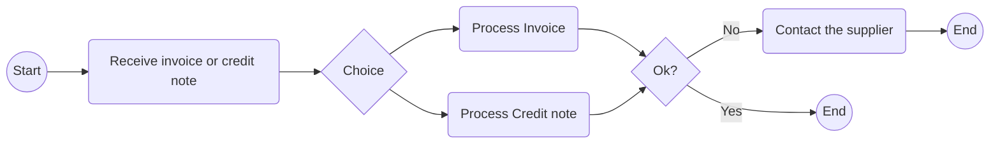

# Guideline for implementation of invoice to payment process

## Table of contents

1. [Introduction](#1)
2. [Process description](#2)

	2.1 [Invoice](#21)


	2.2 [Transport acknowledgement or error/failure](#22)


	2.3 [Message Level Response](#23)


	2.4 [Invoice Responses](#24)


3. [Best practices](#3)


	3.1 [Transport Level Response](#31)


	3.2 [Message Level Response](#32)


	3.3 [Invoice Response](#33)


4. [Message definitions](#4)

	4.1 [Message Level Response 3.0](#41)


	4.2 [Invoice Response transaction 3.1](#42)


5. [Invoice scenarios](#5)

	5.1 [Accepting invoices](#51)


	5.2 [Failures and rejecting invoices](#52)


6. [Remarks](#6)

## <a name="1"></a>1 Introduction

A common concern expressed by sellers and their service providers is the lack of confirmation on whether the buyer has accepted or rejected the invoice. This could result in sellers contacting the buyer out-of-band or incorrectly re-sending invoices.
Additionally, there is a lack of understanding of the different options or system triggers for automated invoice status communication via Peppol, i.e. using the Peppol Invoice Response message.

Both national and international end users as well as service providers express a broad support for the implementation of status messages, with most feedback indicating that it is vital to the success of the network.
In response to this The Netherlands Peppol Authority will make the implementation and use of the Message Level Response and Invoice Response part of the Dutch Peppol scheme in  2022.
This document describes the invoice process and points out which role the Message Level Response and Invoice Response play within this process.
The technical implications of the implementation of the Message Level Response and Invoice Response are currently included in this document, but might be moved to a separate document.

## <a name="2"></a>2 Process description

1.	A supplier (corner 1) issues and initiates the invoice process by issuing an invoice addressed to the Peppol identifier of the customer (also referred to as buyer). The supplier must have a secure channel to send the invoice to his/her own Peppol serviceprovider (corner 2). Within Peppol terminology, the serviceprovider is also defined as “Access Point”.
2.	The serviceprovider of the supplier (corner 2) recognizes the customer (corner 4) and customer’s serviceprovider (corner 3) by resolving the identifier within the invoice document.
3.	The serviceprovider of the supplier might need to transform the invoice to a registered Invoice document type before validating the invoice according to agreed specifications.
4.	The serviceprovider of the supplier wraps the validated invoice in an envelope and sends the message on behalf of the supplier to the serviceprovider of the customer by using the Peppol mechanism (including a signed MDN process).
5.	The serviceprovider of the customer acknowledges the receival of the message by sending a Transport acknowledgement to the serviceprovider of the supplier.
6.	The serviceprovider of the customer might unwrap the message and acknowledges or rejects the invoice based on syntactical and semantical rules by sending a Message Level Response to the serviceprovider of the supplier.
7.	The serviceprovider of the customer might transform a validated invoice to the invoice document type that can be processed by the invoice control system of the customer before sending it to the customer through the implemented secure channel.
8.	The customer receives the invoice and processes it in the invoice control system leading to one of the following results:
    * The customer fully approves the invoice, posts it in the accounting system and passes it on to be paid.
    * The customer completely rejects the invoice and requests a credit note.
    * The customer disputes parts of the invoice and requests a credit note and a new invoice.

9.	The customer sends an invoice response document to the serviceprovider of the customer addressed to the Peppol identifier of the supplier, provided as endpointID.
10.	The serviceprovider of the customer recognizes the supplier and supplier’s serviceprovider by resolving the identifier within the invoice response document.
11.	The serviceprovider of the customer wraps the invoice response in an envelope and sends the message on behalf of the customer to the serviceprovider of the supplier.
12.	The serviceprovider of the supplier unwraps the message and forwards the invoice response to the supplier.

The diagram below shows the basic invoicing process with the use of this PEPPOL BIS profile.
This process assumes that both the invoice and the credit note are exchanged electronically.


> Note: For Transport Acknowledgement a dotted line is used to point out that this is not a BIS message but it is part of the AS4 feedback communication between serviceproviders. See section 2.2

### <a name="21"></a>2.1 Invoice

The invoicing process includes issuing and sending the invoice and the credit note from the supplier to the customer and the reception and handling at the customer’s site.
*	The invoice refers to one order and a specification of delivered goods and services.
*	An invoice may also refer to a contract or a frame agreement.
*	The invoice may specify articles (goods and services) with article number or article description.




### <a name="22"></a>2.2 Transport acknowledgement or error/failure
These are messages that are exchanged within the transport network(s) to inform about the process of carrying a message down the transport line.
These responses may inform someone up-line that the delivery to a given point was successful or not and may contain details about issues that are relevant such as why a delivery was not successful.
The key nature of these responses is that they do not in any way act on result of validation or processing of the content of the payload that is being transported.
These response messages are commonly called “acks”.
Thus, unlike a Message Level Response and Invoice Response, a Transport Acknowledgement is not a document that is exchanged over the network.
The reason Transport acknowledgements are explicitly mentioned in this document is that they are a key element of the feedback cycle and therefore also of the (invoicing) process.

> For more information about how to properly use transport acknowledgements refer to [Peppol AS4 specifications](https://docs.peppol.eu/edelivery/as4/specification/) and the "Best current practices" document that is maintained by the Dutch Serviceprovider community.

### <a name="23"></a>2.3 Message Level Response
When a message has reached a given point in the transport line its content can be validated according to agreed specifications that may be both syntactical and semantic.
The outcome of these validations should be reported to a relevant party up-line, informing him whether the validation was successful or not as well as giving some details.
An example could be that an invoice message that is received is rejected because it is missing a closing tag (syntax error) or because its amounts don’t add up according to what is specified in the relevant syntax specification.
A key nature of these messages is that they report on the message content on the basis of the technical specifications that apply to the message of the sender.


### <a name="24"></a>2.4 Invoice Responses
A message that has been received and accepted for processing may call for an action on the receiver’s behalf.
That receiver’s action can be reported back up-line to a relevant party.
An example is that a technically correct invoice may be received but the receiver decides to reject the invoice for any business reason such as an invalid Purchase Ordernumber.
The key nature of these responses is that they report a business decision that is made on the message instance received.
We want to state clearly that any business requirements that are applied on top of the standard document business rules must have been explicitly communicated by the customer to the supplier.
This can be done by mentioning the specific requirements in a tender, in the purchase order agreement or on a publicly known webpage, for example [basisfactuur Rijk](https://logius.nl/diensten/e-factureren/handreiking-basisfactuur-rijk).



## <a name="3"></a>3 Best practices

### <a name="31"></a>3.1 Transport Level Response

Apart from the default transport-level errors as defined by the CEF eDelivery AS4 profile, the Peppol AS4 profile only specifies one additional transport-level error message, EBMS:0004 with errorDetail PEPPOL:NOT_SERVICED. This error is to be used if either the recipient is not known to the receiving access point, or the recipient does not support the specific document type or business process. The profile states the following:

> If an MSH is able to execute custom validations of the payload of a User Message during the ebMS message processing, it is RECOMMENDED that the Access Point includes the check on the addressee, document type id and process id. In case the addressed participant is not serviced for the specific document type and process by the Access Point, it MUST generate and send back an ebMS Error.

This is a conflicting requirement: the RECOMMENDED keyword states the check is optional, but the MUST keyword makes the check mandatory.

Either way, the best practice is to always perform these checks, as there is no way to deliver a document to a recipient that is not known to the receiving access point. If no transport-level error would be returned, the sending access point would be unaware that the document is not delivered, and the document would get lost.

### <a name="32"></a>3.2 Message Level Response

#### 3.2.1 Scope

The scope of the Message Level Response is:

1. The Message Level Response uses BIS Message Level Response 3.0 (see this link for the [Peppol business documentation](https://docs.peppol.eu/poacc/upgrade-3/profiles/36-mlr/). The technical UBL message used is ApplicationResponse. See paragraph 5 for the message definition.
2. The Message Level Response is sent by the customer AP (C3) on behalf of the customer (C4) to the supplier EndpointId (C1) and always refers to the envelop of the business document sent by the supplier conform standard Peppol exchange mechanisms (including use of SML and SMP). Though the supplier EndpointId is used for routing, the document MUST at least be processed by the supplier AP (C2). As it is the supplier AP's responsibility to validate business documents before sending it to the customer AP, receiving an MLR could mean that the supplier AP failed to execute this responsibility.
3. When publishing MLR support for a supplier in your SMP the record should point to the sending AP, meaning that the supplier sending AP (C2) will receive the Message Level Response to match it to the Transaction ID of the sent document.
4. The following errors are within the scope for a negative/rejecting Message Level Response:
 	* XML schema validation error.
	* Standard Compliance violations (e.g. empty elements not being allowed by UBL 2.1).
	* Validation error of type fatal error.
	* Validation error of type warning. Warnings alone must NOT cause rejection of the business document (but they may be reported in addition to fatal errors).
	* Wrong version of business document if not detected during transport (Will be handled like validation error of type fatal error).
5. Should not be used to indicate delivery failures between C3 and C4. This can be a motivation to start using the invoice response to get information about the delivery to C4. 

> The topic mentioned in bullet 5 should be discussed within an OpenPeppol workgroup.

#### 3.2.2 Response and status codes

1. The support of a Message Level Response is mandatory for Serviceproviders that offer services to Dutch endusers.
2. Dutch endusers must support receiving a Message Level Response.
3. The sending of a Message Level Response is mandatory when C1 is supporting the Message Level Response.

The PEPPOL BIS Message Level Response supports a number of optional and mandatory status codes.
In order to have a proper understanding of the status in the process there is a strict order in which the status codes need to be used.
The order is shown in the table below.

| Status Code   | UNECE name                | BIS usage               					| Clarification on requirements | Mandatory 	| Final |
|--             |----                       |----------               					|--                             |--         	|--     |
| AB            | Message acknowledgement   | Document received by ServiceProvider			| NO                            | NO		| NO    |
| RE            | Rejected                  | Rejected, document did not pass schematron validation	| YES                           | YES       	| YES   |
| AP            | Accepted                  | Accepted, but not (yet) read by customer              	| NO                            | NO       	| YES   |

#### 3.2.3 Routing

The MLR is a business document indicating the technical status of a document sent to the sender of the document. The MLR refers to the instance Identifier of the envelop of the document sent. The instance Identifier must be stored during creation of the document to be able to handle the returned MLR. When the sender AP creates the envelop and does not share the instance Identifier with the original sender the MLR can only be handled by the original sender AP. To be able to receive the MLR, the original sender AP must be registered as ServiceEndpointList/Endpoint in the original sender indentifier SMP records for MLR documents. If the sender AP does not own the SMP records for the sender indentifier the AP must ask the owner of the identifier to register the MLR document.

> It is bad practise to point to any other identifier than the original sender or original receiver in the SBD envelop. The original sender or receival always being an enduser. To be more precise, setting the identifier in the SBD envelop to an identifier of an accesspoint instead of an enduser is not advised by the NPa. The NPa recognizes that the SBD envelop may be used outside the scope of the AP’s.

#### 3.2.4 Mapping

As stated in the [Peppol MLR Party Identification](https://docs.peppol.eu/poacc/upgrade-3/profiles/36-mlr/#_party_identification). The element `cac:SenderParty/cbc:EndpointID` MUST contain the party identification of the **receiver** of the original envelope. And the `cac:ReceiverParty/cbc:EndpointID` MUST contain the party identification of the **sender** of the original envelope.
 
| Envelope of original document sent        | MLR                                                 |
|-----                                      |------                                               |
| Sender/Identifier                         | cac:ReceiverParty/cbc:EndpointID                    |
| Receiver/Identifier	                    | cac:SenderParty/cbc:EndpointID                      |
| DocumentIdentification/InstanceIdentifier | cac:DocumentResponse/cac:DocumentReference/cbc:ID  |

### <a name="33"></a>3.3 Invoice Response

#### 3.3.1 Scope

The scope of the Invoice Response is:

1. The Invoice Response Message uses PEPPOL BIS Invoice Response 3.1 (see this link for the [Peppol business documentation](https://docs.peppol.eu/poacc/upgrade-3/profiles/63-invoiceresponse/). The technical UBL message used is ApplicationResponse. See paragraph 5 for the message definition.
2. The Invoice Response Message is sent by the customer AP to the supplier AP conform standard Peppol exchange mechanisms (including use of SML and SMP) and always refers to an invoice message sent by the supplier AP.
3. The actual invoice status lives in the customer ERP system and should be delivered to the supplier ERP system. Customer and supplier choose their own channel and format to exchange the invoice status to from their AP to their ERP systems.
4. The business meaning of the invoice status remains the same through the entire chain (e.g. the definition of the status ‘Accepted’ is the same in the entire chain).
5. An Invoice may result in multiple Invoice Response messages.

#### 3.3.2 Timeframes for response

Timely and clear communication of invoice status will assist sellers to improve their data quality and reduce future rejections. This is especially important for newly on-boarded suppliers.

It is a requirement by the Peppol BIS standard that C1 should receive a response within 3 working days.
From an automation perspective 3 workings days is quite a long time. Therefor the suggested best practices are:

1.	Where C4 has implemented automated processing, it is best practice to send a response / C4 confirmation of receipt within 1 hour, i.e. AB- acknowledgement or a more advanced processing status.
2.	During C4 processing (manual or automated), when invoice status changes, the change of status should be communicated to C1 within 1 hour or as soon as applicable. E.g. the status changes from AB- Acknowledgement to RE- Rejected.

#### 3.3.3 Status codes

The PEPPOL BIS Invoice Response supports a number of optional and mandatory status codes.
In order to have a proper understanding of the status of invoices in the process there is a strict order in which the status codes need to be used.
The order is shown in the table below.


| Status Code   | UNECE name                | BIS usage                                                                                                                                                                                                                                                                         | Clarification on requirements | Mandatory | Final |
|--             |----                       |----------                                                                                                                                                                                                                                                                         |--                             |--         |--     |
| AB            | Message acknowledgement   | Status is used when Buyer has received a readable invoice message that can be understood and submitted for processing by the Buyer.                                                                                                                                               | NO                            | YES       | NO    |
| IP            | In Process                | Status is used when the processing of the Invoice has started in Buyers system.                                                                                                                                                                                                   | NO                            | NO        | NO    |
| UQ            | Under query               | Status is used when Buyer will not proceed to accept the Invoice without receiving additional information from the Seller.                                                                                                                                                        | YES                           | NO        | NO    |
| CA            | Conditionally accepted    | Status is used when Buyer is accepting the Invoice under conditions stated in ‘Status Reason’ and proceed to pay accordingly unless disputed by Seller.                                                                                                                           | YES                           | NO        | NO    |
| RE            | Rejected                  | Status is used only when the Buyer will not process the referenced Invoice any further.Buyer is rejecting this invoice but not necessarily the commercial transaction. Although it can be used also for rejection for commercial reasons (invoice not corresponding to delivery). | YES                           | YES       | YES   |
| AP            | Accepted                  | Status is used only when the Buyer has given a final approval of the invoice and the next step is payment                                                                                                                                                                         | NO                            | YES       | YES   |
| PD            | Fully Paid                | Status is used only when the Buyer has initiated the payment of the invoice.                                                                                                                                                                                                      | NO                            | NO        | NO    |


> Note that individual ERP vendors may have different process flow implementations and thus might not generate a status that corresponds with the codes in this list.
Also the ERP vendor might not use the statusses in the same orders as defined here.

Within the required response timeframe, C4 can choose the most appropriate status code for the first response - i.e. it is not mandatory to use “AB” as the first response. For example, if C4 has completed processing an invoice within one hour with no issues found, C4 can send only one invoice response with a status code of “AP – Accepted”. If C4 has identified an issue during processing, which requires investigation and takes longer to process, C4 may choose to send “AB” to confirm invoice receipt; or use “UQ” to notify C1 that C4 requires additional information and may contact the supplier.

C4 should provide clear and meaningful reasons to assist C1 to take action. This can be done using a combination of Peppol-defined status reason and action codes and free text fields. Further details about specific invoice scenarios are provided in section 5.

## <a name="4"></a>4 Message definitions

The latest version of the syntax of the BIS3 Message Level Response and Invoice Response can be found on the website of OpenPeppol:
*  https://docs.peppol.eu/poacc/upgrade-3/syntax/MLR/tree/
*  https://docs.peppol.eu/poacc/upgrade-3/syntax/InvoiceResponse/tree/

In the following sections you will find a detailed description of the syntax and semantics that apply at the time of writing this document.

### <a name="41"></a>4.1 Message Level Response 3.0

Field                                         | Example content                                                                                   | Card.   | Data type     | Explanation
----                                          | ---                                                                                               | ---           | ---           | ---
xml                                           | attributes => version="1.0" encoding="UTF-8"                                                      |               |               |
ApplicationResponse                           |                                                                                                   | 1..1          |               |
:black_medium_small_square: cbc:CustomizationID                       | urn:fdc:peppol.eu:poacc:trns:mlr:3                                                                | 1..1          | Identifier    |
:black_medium_small_square: cbc:ProfileID                             | urn:fdc:peppol.eu:poacc:bis:mlr:3                                                                 | 1..1          | Identifier    |
:black_medium_small_square: cbc:ID                                    | Unique identification transaction                                                                   | 1..1          | Identifier    | Identification of the Message Level Response.
:black_medium_small_square: cbc:IssueDate                             | 10-2-2021                                                                                         | 1..1          | Date          | Message Level Response issue date
:black_medium_small_square: cbc:IssueTime                             | 13:34:32                                                                                          | 0..1          | Time          | Message Level Response issue time
:black_medium_small_square: cac:SenderParty                           |                                                                                                   | 1..1          |               | Sender information
:black_medium_small_square::black_medium_small_square: cbc:EndpointID                         | [CoC number] or [OIN number] or [VAT number]                                                      | 1..1          | Identifier    | Identifies the sender party's electronic address
:black_medium_small_square::black_medium_small_square::black_medium_small_square: @schemeID                           | 0106 = NL:KVK  or  0190 = NL:OIN  or  9944 = NL:VAT                                               | 1..1          | attribute     | Electronic Address Scheme (f.e. 0106 or 0190)
:black_medium_small_square: cac:ReceiverParty                         |                                                                                                   | 1..1          |               | Receiver of the Message Level Response
:black_medium_small_square::black_medium_small_square: cbc:EndpointID                         | [CoC number] or [OIN number] or [VAT number]                                                      | 1..1          | Identifier    | Reciever party electronic address
:black_medium_small_square::black_medium_small_square::black_medium_small_square: @schemeID                           | 0106 = NL:KVK  or  0190 = NL:OIN  or  9944 = NL:VAT                                               | 1..1          | attribute     | Scheme identifier
:black_medium_small_square: cac:DocumentResponse                      |                                                                                                   | 1..1          |               | Document response
:black_medium_small_square::black_medium_small_square: cac:Response                           |                                                                                                   | 1..1          |               | Response information
:black_medium_small_square::black_medium_small_square::black_medium_small_square: cbc:ResponseCode                    | AB = Message acknowledgement or AP = accepted or RE = Rejected                                    | 1..1          | Identifier    | Message response code
:black_medium_small_square::black_medium_small_square::black_medium_small_square: cbc:Description                     | Rejected due to validation errors                                                                 | 0..1          | Identifier    | Response textual notes
:black_medium_small_square::black_medium_small_square: cac:DocumentReference                  |                                                                                                   | 1..1          |               |
:black_medium_small_square::black_medium_small_square::black_medium_small_square: cbc:ID                              | Reference to the envelope Message ID                                                              | 1..1          | Identifier    | Document identifier
:black_medium_small_square::black_medium_small_square::black_medium_small_square: cbc:DocumentTypeCode                | 380 = Commercial invoice or 381 = Credit note or 384 = Corrected invoice                          | 0..1          | Identifier    | Document type code
:black_medium_small_square::black_medium_small_square::black_medium_small_square: cbc:VersionID                       |                                                                                                   | 0..1          | Identifier    | Document version identifier
:black_medium_small_square::black_medium_small_square: cac:LineResponse                       |                                                                                                   | 0..n          |               | Line response information
:black_medium_small_square::black_medium_small_square::black_medium_small_square: cac:LineReference                   |                                                                                                   | 1..1          |               | Line reference
:black_medium_small_square::black_medium_small_square::black_medium_small_square::black_medium_small_square: cbc:LineID                       | Contains XPath to the element that causes the error. If XPath cannot be provided use NA           | 1..1          |               | Section identifier
:black_medium_small_square::black_medium_small_square::black_medium_small_square: cac:Response                        |                                                                                                   | 1..1          |               | Line response information
:black_medium_small_square::black_medium_small_square::black_medium_small_square::black_medium_small_square: cbc:ResponseCode                 | AB = Message acknowledgement or AP = accepted or RE = Rejected                                    | 0..1          | Identifier    | Line response code
:black_medium_small_square::black_medium_small_square::black_medium_small_square::black_medium_small_square: cbc:Description                  | "A buyer reference or purchase order reference MUST be provided."                                 | 1..1          | Text          | Issue description
:black_medium_small_square::black_medium_small_square::black_medium_small_square::black_medium_small_square: cac:Status                       |                                                                                                   | 1..1          |               | Status information
:black_medium_small_square::black_medium_small_square::black_medium_small_square::black_medium_small_square::black_medium_small_square: cbc:StatusReasonCode          | "BV = fatal  or  BW = warning  or  SV = Syntax violation                                          | 1..1          |               | Issue type coded

#### <a name="411"></a>4.1.1 MLR considerations

The specification uses an example of an xpath with cac: and cbc: prefixes. These are commonly used namespace prefixes, but an implementation should in principle either use the namespace prefixes of the original document, or drop the namespaces in full. The NPA test tool uses namespace-uri() calls in the xpath selectors for this purpose. The NPA is an advocate of standardizing the use of prefixes. Therefor we suggest to always use doc: / cac: / cbc:

### <a name="42"></a>4.2 Invoice Response transaction 3.1

Field                                         | Example content                                                                                   | Card.   | Data type     | Explanation
---                                           | ---                                                                                               | ---           | ---           | ---
xml                                           | attributes => version="1.0" encoding="UTF-8"                                                      |               |               |
ApplicationResponse                           |                                                                                                   | 1..1          |               |
:black_medium_small_square: cbc:CustomizationID                       | urn:fdc:peppol.eu:poacc:trns:invoice_response:3                                                   | 1..1          | Identifier    |
:black_medium_small_square: cbc:ProfileID                             | urn:fdc:peppol.eu:poacc:bis:invoice_response:3                                                    | 1..1          | Identifier    |
:black_medium_small_square: cbc:ID                                    | Unique identification transaction                                                                   | 1..1          | Identifier    | Identification of the Invoice Response message.
:black_medium_small_square: cbc:IssueDate                             | 10-2-2021                                                                                         | 1..1          | Date          | Invoice Response issue date
:black_medium_small_square: cbc:IssueTime                             | 13:34:32                                                                                          | 0..1          | Time          | Invoice Response issue time
:black_medium_small_square: cbc:Note                                  | Please contact Joop Jansen for any additional questions                                           | 0..1          | Text          | General comments or instructions that are relevant to the response as a whole
:black_medium_small_square: cac:SenderParty                           |                                                                                                   | 1..1          |               | Sender Party
:black_medium_small_square::black_medium_small_square: cbc:EndpointID                         | 12345678                                                                                          | 1..1          | Identifier    | Identifies the sender party's electronic address
:black_medium_small_square::black_medium_small_square::black_medium_small_square: @schemeID                           | 0106                                                                                              | 1..1          |               | Electronic Address Scheme (f.e. 0106 or 0190)
:black_medium_small_square::black_medium_small_square: cac:PartyIdentification                |                                                                                                   | 0..1          |               | Party identification
:black_medium_small_square::black_medium_small_square::black_medium_small_square: cbc:ID                              | 12345678                                                                                          | 1..1          | Identifier    | Party identifier
:black_medium_small_square::black_medium_small_square::black_medium_small_square::black_medium_small_square: @schemeID                        | 0106                                                                                              | 0..1          | Identifier    | Electronic Address Scheme (f.e. 0106 or 0190)
:black_medium_small_square::black_medium_small_square: cac:PartyLegalEntity                   |                                                                                                   | 1..1          |               |
:black_medium_small_square::black_medium_small_square::black_medium_small_square: cbc:RegistrationName                | Haagse administratiegroep                                                                         | 1..1          | Text          | Sender party name
:black_medium_small_square::black_medium_small_square: cac:Contact                            |                                                                                                   | 0..1          |               | Contact information
:black_medium_small_square::black_medium_small_square::black_medium_small_square: cbc:Name                            | Joop Jansen                                                                                       | 0..1          | Text          | Party contact point name
:black_medium_small_square::black_medium_small_square::black_medium_small_square: cbc:Telephone                       | 0524 000000                                                                                       | 0..1          | Text          | Party contact point telephone
:black_medium_small_square::black_medium_small_square::black_medium_small_square: cbc:ElectronicMail                  | joop@administratie9999mail.nl                                                                     | 0..1          | Text          | Party contact point email
:black_medium_small_square: cac:ReceiverParty                         |                                                                                                   | 1..1          |               | Receiver party
:black_medium_small_square::black_medium_small_square: cbc:EndpointID                         |                                                                                                   | 1..1          | Identifier    | Reciever party electronic addressr
:black_medium_small_square::black_medium_small_square::black_medium_small_square: @schemeID                           | 0106                                                                                              | 1..1          | Identifier    | Electronic Address Scheme (f.e. 0106 or 0190)
:black_medium_small_square::black_medium_small_square: cac:PartyIdentification                |                                                                                                   | 0..1          |               | Party identification
:black_medium_small_square::black_medium_small_square::black_medium_small_square: cbc:ID                              |                                                                                                   | 1..1          |               | Reciever party identifier
:black_medium_small_square::black_medium_small_square::black_medium_small_square::black_medium_small_square: @schemeID                        | 0106                                                                                              | 0..1          | Identifier    | Electronic Address Scheme (f.e. 0106 or 0190)
:black_medium_small_square::black_medium_small_square: cac:PartyLegalEntity                   |                                                                                                   | 1..1          |               |
:black_medium_small_square::black_medium_small_square::black_medium_small_square: cbc:RegistrationName                | Coevorden handelsbedrijf                                                                          | 1..1          | Text          | Receiver party name
:black_medium_small_square: cac:DocumentResponse                      |                                                                                                   | 1..1          |               | Document response
:black_medium_small_square::black_medium_small_square: cac:Response                           |                                                                                                   | 1..1          |               |
:black_medium_small_square::black_medium_small_square::black_medium_small_square: cbc:ResponseCode                    | AP                                                                                                | 1..1          | Code          | Invoice status (UNCL4343)
:black_medium_small_square::black_medium_small_square::black_medium_small_square: cbc:EffectiveDate                   | 10-2-2021                                                                                         | 0..1          | Date          | Status date
:black_medium_small_square::black_medium_small_square: cac:Status                             |                                                                                                   | 0..N          |               | Clarification information, mandatory when invoice status is UQ-Under query, RE - Rejected or CA - Conditionally Accepted.
:black_medium_small_square::black_medium_small_square::black_medium_small_square: cbc:StatusReasonCode                | OA                                                                                                | 0..1          | Identifier    | Clarification code
:black_medium_small_square::black_medium_small_square::black_medium_small_square::black_medium_small_square: @listID                          | OPStatusAction or OPStatusReason                                                                  | 1..1          | Code          | List identifier
:black_medium_small_square::black_medium_small_square::black_medium_small_square: cbc:StatusReason                    |                                                                                                   | 0..1          | Text          | Clarification description
:black_medium_small_square::black_medium_small_square: cac:Condition                          |                                                                                                   | 0..N          |               | Condition
:black_medium_small_square::black_medium_small_square::black_medium_small_square: cbc:AttributeID                     |                                                                                                   | 1..1          | Code          | Detail type code
:black_medium_small_square::black_medium_small_square::black_medium_small_square: cbc:Description                     |                                                                                                   | 0..1          | Text          | Detail value
:black_medium_small_square::black_medium_small_square: cac:DocumentReference                  |                                                                                                   | 1..1          |               | Document reference
:black_medium_small_square::black_medium_small_square::black_medium_small_square: cbc:ID                              | 2021932                                                                                           | 1..1          | Identifier    | Invoice identifier
:black_medium_small_square::black_medium_small_square::black_medium_small_square: cbc:IssueDate                       | 9-2-2021                                                                                          | 0..1          | Date          | Invoice issue date
:black_medium_small_square::black_medium_small_square::black_medium_small_square: cbc:DocumentTypeCode                | 380 = Commercial invoice or 381 = Credit note or 384 = Corrected invoice                          | 1..1          | Code          | Identifier type code
:black_medium_small_square: cac:IssuerParty                           |                                                                                                   | 0..1          |               | Seller party information
:black_medium_small_square::black_medium_small_square: cac:PartyIdentification                |                                                                                                   | 0..1          |               | Party identification
:black_medium_small_square::black_medium_small_square::black_medium_small_square: cbc:ID                              |                                                                                                   | 1..1          |               | Seller party identifier
:black_medium_small_square::black_medium_small_square::black_medium_small_square::black_medium_small_square: @schemeID                        | 0106                                                                                              | 0..1          |               | Electronic Address Scheme (f.e. 0106 or 0190)
:black_medium_small_square::black_medium_small_square: cac:PartyName                          |                                                                                                   | 1..1          |               | Party name information
:black_medium_small_square::black_medium_small_square::black_medium_small_square: cbc:Name                            | Coevorden handelsbedrijf                                                                          | 0..1          | Text          | Seller party name
:black_medium_small_square: cac:RecipientParty                        |                                                                                                   | 0..1          |               | Buyer party information
:black_medium_small_square::black_medium_small_square: cac:PartyIdentification                |                                                                                                   | 0..1          |               | Party identification
:black_medium_small_square::black_medium_small_square::black_medium_small_square: cbc:ID                              |                                                                                                   | 1..1          | Identifier    | Buyer party identifier
:black_medium_small_square::black_medium_small_square::black_medium_small_square::black_medium_small_square: @schemeID                        | 0106                                                                                              | 0..1          |               | Electronic Address Scheme (f.e. 0106 or 0190)
:black_medium_small_square::black_medium_small_square: cac:PartyName                          |                                                                                                   | 1..1          |               | Party name information
:black_medium_small_square::black_medium_small_square::black_medium_small_square: cbc:Name                            | Haagse administratiegroep                                                                         | 1..1          | Text          | Buyer party name

## <a name="5"></a>5 Invoice scenarios

This section describes common business scenarios and provides examples to illustrate how a customer (C4) and serviceprovider of a customer (C3) can communicate message level- and invoice statusses with a serviceprovider of a supplier (C2) and a supplier (C1) via Peppol.

Type 			| Scenario name 			 
---  			| ---					 
:heavy_check_mark:	| [Direct acceptance](#511)			
:heavy_check_mark:	| [Invoice fails 3-way matching - Follow up with C1 out of channel leading to acceptance](#512)
:heavy_check_mark:	| [Invoice fails bank account number - Follow up with C1 out of channel leading to acceptance](#513)
:x:			| [Transport error or rejection due to unknown recipient, unsupported document type, or unsupported process](#521)
:x:			| [Syntax incorrect and/or schematron error](#522)
:x:			| [Unable to deliver invoice to customer](#523)
:x:			| [Invoice fails 3-way matching - Rejecting the invoice](#524)
:x:			| [Invoice fails 3-way matching - Follow up with C1 out of channel leading to rejection](#525)
:x:			| [Bank account details not matching](#526)
:x:			| [Supplier unknown in customer master data](#527)
:x:			| [Payment terms or invoice due date not as expected](#528)
:x:			| [Incorrect delivery of goods](#529)
:x:			| [Duplicate invoice](#5210)
:x:			| [VAT incorrect](#5211)


### <a name="51"></a>5.1 Accepting invoices

Type 			| Scenario name 			 
---  			| ---					 
:heavy_check_mark:	| [Direct acceptance](#511)			
:heavy_check_mark:	| [Invoice fails 3-way matching - Follow up with C1 out of channel leading to acceptance](#512)
:heavy_check_mark:	| [Invoice fails bank account number - Follow up with C1 out of channel leading to acceptance](#513)

##### <a name="511"></a>5.1.1 Direct acceptance

**Scenario**

This scenario is also known as the happy flow.
An invoice is received successfully by a customer and can be successfully processed and approved for payment.

**Feedback cycle**

Step 	| Message                	    | Status	| Use
---	    | ---                    		| ---     	| ---
1	    | Transport Acknowledgement     | OK		| Mandatory
2	    | Message Level Response 		| AB		| Optional
3	    | Message Level Response		| AP		| Mandatory
4	    | Invoice Response 			    | AB 		| Mandatory
5	    | Invoice Response			    | AP		| Mandatory
6	    | Invoice Response			    | PD		| Optional

**Example Invoice Response content**

Buyer gives final approval of the invoice.

```XML
<?xml version="1.0" encoding="UTF-8"?>
<ApplicationResponse xmlns="urn:oasis:names:specification:ubl:schema:xsd:ApplicationResponse-2"
					 xmlns:cac="urn:oasis:names:specification:ubl:schema:xsd:CommonAggregateComponents-2"
					 xmlns:cbc="urn:oasis:names:specification:ubl:schema:xsd:CommonBasicComponents-2">
	<cbc:CustomizationID>urn:fdc:peppol.eu:poacc:trns:mlr:3</cbc:CustomizationID>
	<cbc:ProfileID>urn:fdc:peppol.eu:poacc:bis:mlr:3</cbc:ProfileID>
	<cbc:ID>NPA-MLR001</cbc:ID>
	<cbc:IssueDate>2022-05-01</cbc:IssueDate>
	<cbc:IssueTime>12:01:02</cbc:IssueTime>
	<cac:SenderParty>
		<cbc:EndpointID schemeID="0190">00000004003214345001</cbc:EndpointID>
	</cac:SenderParty>
	<cac:ReceiverParty>
		<cbc:EndpointID schemeID="0190">00000099003214345001</cbc:EndpointID>
	</cac:ReceiverParty>
	<cac:DocumentResponse>
		<cac:Response>
			<cbc:ResponseCode>AP</cbc:ResponseCode>
		</cac:Response>
		<cac:DocumentReference>
			<cbc:ID>118e3040-51d2-11e3-8f96-0800200c9a66</cbc:ID>
			<cbc:DocumentTypeCode>380</cbc:DocumentTypeCode>
			<cbc:VersionID>2</cbc:VersionID>
		</cac:DocumentReference>
	</cac:DocumentResponse>
</ApplicationResponse>
```

##### <a name="512"></a>5.1.2 Invoice fails 3-way matching - Follow up with C1 out of channel leading to acceptance

**Scenario**

A supplier (C1) sends an invoice that contains a purchase order number that cannot be matched to a purchase order number for the supplier in the ERP system of the customer (C4).
The customer decides to contact the supplier to discuss the issue outside the channel.
Resolving the issue leads to acceptance of the invoice.

**Feedback cycle**

Step 	| Message                		| Status	| Use
--- 	| ---                    		| ---     	| ---
1 	    | Transport Acknowledgement    	| OK		| Mandatory
2 	    | Message Level Response 		| AB		| Optional
3 	    | Message Level Response		| AP		| Mandatory
4 	    | Invoice Response 			    | AB 		| Mandatory
5 	    | Invoice Response			    | UQ		| Mandatory
6 	    | Invoice Response			    | AP		| Mandatory
7 	    | Invoice Response			    | PD		| Optional

**Example Invoice Response content**

The processing of the invoice has been halted by the customer. Customer requests additional information from the supplier.

```XML
<cac:Response>
  <cbc:ResponseCode listID="UNCL4343OpSubset">UQ</cbc:ResponseCode>
  <cbc:EffectiveDate>2020-11-01</cbc:EffectiveDate>
  <cac:Status>
    <cbc:StatusReasonCode listID="OPStatusReason">REF</cbc:StatusReasonCode>
    <!--using the free text field to provide detailed description-->
    <cbc:StatusReason>Purchase order number is invalid. The format should be POnnnnnn</cbc:StatusReason>
  </cac:Status>
</cac:Response>
```

Customer accepts the invoice based on additional information received from the supplier.

```XML
<cac:Response>
  <cbc:ResponseCode listID="UNCL4343OpSubset">AP</cbc:ResponseCode>
  <cbc:EffectiveDate>2020-11-01</cbc:EffectiveDate>
  <cac:Status>
    <cbc:StatusReasonCode listID="OPStatusReason">NON</cbc:StatusReasonCode>
  </cac:Status>
</cac:Response>
```

##### <a name="513"></a>5.1.3 Invoice fails bank account number - Follow up with C1 out of channel leading to acceptance

**Scenario**

A supplier (C1) sends an invoice that contains a bank account number that is not known in the ERP system of the customer (C4).
The supplier has probably forgotten to inform the customer of a changed bank account number, but it could be a potential case of fraude.
Human intervention is preferred in this case to prevent potential fraud cases.
The customer contacts the supplier to verify the new information with the supplier.

**Feedback cycle**

Step 	| Message                		    | Status	| Use
--- 	| ---                    		    | ---     	| ---
1 	    | Transport Acknowledgement       	| OK		| Mandatory
2 	    | Message Level Response 		    | AB		| Optional
3 	    | Message Level Response		    | AP		| Mandatory
4 	    | Invoice Response 			        | AB 		| Mandatory
5 	    | Invoice Response			        | UQ		| Mandatory
6 	    | Invoice Response			        | AP		| Mandatory

**Example Invoice Response Content**

```XML
<cac:Response>
  <cbc:ResponseCode listID="UNCL4343OpSubset">AB</cbc:ResponseCode>
  <cbc:EffectiveDate>2020-11-01</cbc:EffectiveDate>
</cac:Response>
```

The processing of the invoice has been halted by the customer. Customer will verify the new information with the supplier.

```XML
<cac:Response>
  <cbc:ResponseCode listID="UNCL4343OpSubset">UQ</cbc:ResponseCode>
  <cbc:EffectiveDate>2020-11-01</cbc:EffectiveDate>
  <cac:Status>
    <cbc:StatusReasonCode listID="OPStatusReason">OTH</cbc:StatusReasonCode>
    <!--using the free text field to provide detailed description-->
    <cbc:StatusReason>Bank account number in invoice does not match known bank account number.</cbc:StatusReason>
  </cac:Status>
</cac:Response>
```

Customer changes bank account information in ERP system after contacting the supplier.
Customer accepts the invoice based on the new information.

```XML
<cac:Response>
  <cbc:ResponseCode listID="UNCL4343OpSubset">AP</cbc:ResponseCode>
  <cbc:EffectiveDate>2020-11-01</cbc:EffectiveDate>
  <cac:Status>
    <cbc:StatusReasonCode listID="OPStatusReason">REF</cbc:StatusReasonCode>
    <!--using the free text field to provide detailed description-->
    <cbc:StatusReason>Bank account number in invoice does not match known bank account number.</cbc:StatusReason>
  </cac:Status>
</cac:Response>
```


### <a name="52"></a>5.2 Failures and rejecting invoices

The following subsections each describe a scenario where a failure occurs in the process of delivering or processing the invoice.

Type 			| Scenario name 			 
---  			| ---					 
:x:			| [Transport error or rejection due to unknown recipient, unsupported document type, or unsupported process](#521)
:x:			| [Syntax incorrect and/or schematron error](#522)
:x:			| [Unable to deliver invoice to customer](#523)
:x:			| [Invoice fails 3-way matching - Rejecting the invoice](#524)
:x:			| [Invoice fails 3-way matching - Follow up with C1 out of channel leading to rejection](#525)
:x:			| [Bank account details not matching](#526)
:x:			| [Supplier unknown in customer master data](#527)
:x:			| [Payment terms or invoice due date not as expected](#528)
:x:			| [Incorrect delivery of goods](#529)
:x:			| [Duplicate invoice](#5210)
:x:			| [VAT incorrect](#5211)

#### <a name="521"></a>5.2.1 Transport error or rejection due to unknown recipient, unsupported document type, or unsupported process

**Scenario**

Supplier (C1) sends an invoice through their service provider (C2). Due to a problem in either an SMP publication or the endpoint lookup process, the service provider attempts to send the document to a service provider that is not servicing C4.

In case the recipient is unknown to the receiving service provider, or the document type or business process is not supported by this recipient, the Peppol AS4 profile states that the receiving access point must send back an error. The errorCode is EBMS:0004 (Other Error) and the errorDetail is "PEPPOL:NOT_SERVICED".

**Feedback cycle**

Step 	| Message                	    | Status					| Use
--- 	| ---                    	    | ---     					| ---
1   	| Transport error        	    | EBMS:0004, PEPPOL:NOT_SERVICED		| Mandatory

#### <a name="522"></a>5.2.2 Syntax incorrect and/or schematron error

**Scenario**

Supplier (C1) sends an invoice where the XML is malformed or where the XML contains FATAL schematron errors.
The serviceprovider of the customer (C3) rejects the invoice by sending a Message Level Response to the serviceprovider of the supplier (C2).

> Note: In theory this scenario should not happen. Peppol compliancy policy states that a ":black_medium_small_square: sender is accountable for the technical correctness and quality of the submitted business documents and shall ensure that submitted business documents are valid according to the relevant specification:black_medium_small_square:".

**Feedback cycle**

Step 	| Message                		    | Status	| Use
--- 	| ---                    		    | ---     	| ---
1 	    | Transport Acknowledgement       	| OK		| Mandatory
2 	    | Message Level Response 		    | AB		| Optional
3 	    | Message Level Response		    | RE		| Mandatory


**Example Message Level Response content**

```XML
<cac:DocumentResponse>
  <cac:Response>
    <cbc:ResponseCode>RE</cbc:ResponseCode>
    <cbc:Description>Rejected due to validation errors</cbc:Description>
  </cac:Response>
  <cac:DocumentReference>
    <cbc:ID>EnvelopeID-12456789</cbc:ID>
    <cbc:DocumentTypeCode>380</cbc:DocumentTypeCode>
  </cac:DocumentReference>
  <cac:LineResponse>
    <cac:LineReference>
      <cbc:LineID>/Invoice/TaxRepresentativeParty/PostalAddress</cbc:LineID>
    </cac:LineReference>
    <cac:Response>
      <cbc:ResponseCode>RE</cbc:ResponseCode>
      <cbc:Description>[NL-R-006] For suppliers in the Netherlands, if the fiscal representative is in the Netherlands, the representative's address (cac:TaxRepresentativeParty/cac:PostalAddress) MUST contain street name (cbc:StreetName), city (cbc:CityName) and post code (cbc:PostalZone)</cbc:Description>
      <cac:Status>
	<cbc:StatusReasonCode>BV</cbc:StatusReasonCode>
      </cac:Status>
    </cac:Response>
  </cac:LineResponse>
</cac:DocumentResponse>
```

#### <a name="523"></a>5.2.3 Unable to deliver invoice to customer

**Scenario**

Supplier (C1) sends a correct invoice, but the serviceprovider of the customer (C3) is unable to deliver the invoice to the customer (C4).

Step 	| Message                		| Status	| Use
--- 	| ---                    		| ---     	| ---
1 	    | Transport Acknowledgement     | OK		| Mandatory
2 	    | Message Level Response 		| AB		| Optional
3 	    | Message Level Response		| AP		| Mandatory
4 	    | Invoice Response 			    | Any 		| Failed to send within 1 hour

##### <a name="524"></a>5.2.4 Invoice fails 3-way matching - Rejecting the invoice

**Scenario**

A supplier (C1) sends an invoice that contains a purchase order number that cannot be matched to a purchase order number for the supplier in the ERP system of the customer (C4).
The customer decides to reject the invoice and asks the supplier to reissue an invoice with the correct purchase order number.

**Feedback cycle**

Step 	| Message                		| Status	| Use
--- 	| ---                    		| ---     	| ---
1 	    | Transport Acknowledgement     | OK		| Mandatory
2 	    | Message Level Response 		| AB		| Optional
3 	    | Message Level Response		| AP		| Mandatory
4 	    | Invoice Response 			    | AB 		| Mandatory
5 	    | Invoice Response			    | RE		| Mandatory

**Example Invoice Response content**

```XML
<cac:Response>
  <cbc:ResponseCode listID="UNCL4343OpSubset">RE</cbc:ResponseCode>
  <cbc:EffectiveDate>2020-11-01</cbc:EffectiveDate>
  <cac:Status>
    <cbc:StatusReasonCode listID="OPStatusReason">REF</cbc:StatusReasonCode>
    <!--using the free text field to provide detailed description-->
    <cbc:StatusReason>Purchase order number is invalid. The format should be POnnnnnn</cbc:StatusReason>
  </cac:Status>
  <!--including an action code to request the sender to send another invoice-->
  <cac:Status>
    <cbc:StatusReasonCode listID="OPStatusAction">NIN</cbc:StatusReasonCode>
  </cac:Status>
</cac:Response>
```

##### <a name="525"></a>5.2.5 Invoice fails 3-way matching - Follow up with C1 out of channel leading to rejection

**Scenario**

A supplier (C1) sends an invoice that contains a purchase order number that cannot be matched to a purchase order number for the supplier in the ERP system of the customer (C4).
The customer decides to not reject the invoice, but instead contacts the supplier to discuss the issue.
Resolving the issue leads to a rejection of the invoice.
See 5.1.2 for the same scenario that leads to acceptance.

**Feedback cycle**

Step 	| Message                		    | Status	| Use
--- 	| ---                    		    | ---     	| ---
1 	    | Transport Acknowledgement       	| OK		| Mandatory
2 	    | Message Level Response 		    | AB		| Optional
3 	    | Message Level Response		    | AP		| Mandatory
4 	    | Invoice Response 			        | AB 		| Mandatory
5 	    | Invoice Response			        | UQ		| Mandatory
6 	    | Invoice Response			        | RE		| Mandatory

**Example Invoice Response Content**

```XML
<cac:Response>
  <cbc:ResponseCode listID="UNCL4343OpSubset">AB</cbc:ResponseCode>
  <cbc:EffectiveDate>2020-11-01</cbc:EffectiveDate>
</cac:Response>
```

```XML
<cac:Response>
  <cbc:ResponseCode listID="UNCL4343OpSubset">UQ</cbc:ResponseCode>
  <cbc:EffectiveDate>2020-11-01</cbc:EffectiveDate>
  <cac:Status>
    <cbc:StatusReasonCode listID="OPStatusReason">OTH</cbc:StatusReasonCode>
    <!--using the free text field to provide detailed description-->
    <cbc:StatusReason>Purchase order number is invalid. The format should be POnnnnnn</cbc:StatusReason>
  </cac:Status>
</cac:Response>
```

```XML
<cac:Response>
  <cbc:ResponseCode listID="UNCL4343OpSubset">RE</cbc:ResponseCode>
  <cbc:EffectiveDate>2020-11-01</cbc:EffectiveDate>
  <cac:Status>
    <cbc:StatusReasonCode listID="OPStatusReason">REF</cbc:StatusReasonCode>
    <!--using the free text field to provide detailed description-->
    <cbc:StatusReason>Purchase order number is invalid. The format should be POnnnnnn</cbc:StatusReason>
  </cac:Status>
  <!--including an action code to request the sender to send another invoice-->
  <cac:Status>
    <cbc:StatusReasonCode listID="OPStatusAction">NIN</cbc:StatusReasonCode>
  </cac:Status>
</cac:Response>
```


#### <a name="526"></a>5.2.6 Bank account details not matching

**Scenario**

A supplier (C1) sends an invoice that contains a bank account number that is not known in the supplier master data of the customer (C4).
The supplier has probably forgotten to inform the customer of a changed bank account number, but it could be a potential case of fraude.
As the information provided on an invoice should not be used to update the supplier master data in the ERP system of the customer, a customer can reject the invoice when validating the bank account number.
Human intervention is preferred in this case to prevent potential fraud cases.

**Feedback cycle**

Step 	| Message                		    | Status	| Use
--- 	| ---                    		    | ---     	| ---
1 	    | Transport Acknowledgement       	| OK		| Mandatory
2 	    | Message Level Response 		    | AB		| Optional
3 	    | Message Level Response		    | AP		| Mandatory
4 	    | Invoice Response 			        | AB 		| Mandatory
5 	    | Invoice Response			        | UQ		| Mandatory
6 	    | Invoice Response			        | RE		| Mandatory

**Example Invoice Response Content**

```XML
<cac:Response>
  <cbc:ResponseCode listID="UNCL4343OpSubset">AB</cbc:ResponseCode>
  <cbc:EffectiveDate>2020-11-01</cbc:EffectiveDate>
</cac:Response>
```

The processing of the invoice has been halted by the customer. Customer will verify the new information with the supplier.

```XML
<cac:Response>
  <cbc:ResponseCode listID="UNCL4343OpSubset">UQ</cbc:ResponseCode>
  <cbc:EffectiveDate>2020-11-01</cbc:EffectiveDate>
  <cac:Status>
    <cbc:StatusReasonCode listID="OPStatusReason">OTH</cbc:StatusReasonCode>
    <!--using the free text field to provide detailed description-->
    <cbc:StatusReason>Bank account number in invoice does not match known bank account number.</cbc:StatusReason>
  </cac:Status>
</cac:Response>
```

Supplier has used wrong bank account number or a case of fraude has been detected.
Customer rejects the invoice.

```XML
<cac:Response>
  <cbc:ResponseCode listID="UNCL4343OpSubset">RE</cbc:ResponseCode>
  <cbc:EffectiveDate>2020-11-01</cbc:EffectiveDate>
  <cac:Status>
    <cbc:StatusReasonCode listID="OPStatusReason">REF</cbc:StatusReasonCode>
    <!--using the free text field to provide detailed description-->
    <cbc:StatusReason>Bank account number in invoice does not match known bank account number.</cbc:StatusReason>
  </cac:Status>
</cac:Response>
```

#### <a name="527"></a>5.2.7 Supplier unknown in customer master data

**Scenario**

A supplier (C1) sends an invoice that a customer (C4), but the supplier is unknown to the customer.
The supplier details cannot be match with any of the supplier master data in the ERP system of the customer.

**Feedback cycle**

Step 	| Message                		    | Status	| Use
--- 	| ---                    		    | ---     	| ---
1 	    | Transport Acknowledgement       	| OK		| Mandatory
2 	    | Message Level Response 		    | AB		| Optional
3 	    | Message Level Response		    | AP		| Mandatory
4 	    | Invoice Response 			        | AB 		| Mandatory
5 	    | Invoice Response			        | RE		| Mandatory

**Example Invoice Response Content**

```XML
<cac:Response>
  <cbc:ResponseCode listID="UNCL4343OpSubset">AB</cbc:ResponseCode>
  <cbc:EffectiveDate>2020-11-01</cbc:EffectiveDate>
</cac:Response>
```

Customer rejects the invoice based on not finding a match in the supplier master data.

```XML
<cac:Response>
  <cbc:ResponseCode listID="UNCL4343OpSubset">RE</cbc:ResponseCode>
  <cbc:EffectiveDate>2020-11-01</cbc:EffectiveDate>
  <cac:Status>
    <cbc:StatusReasonCode listID="OPStatusReason">UNR</cbc:StatusReasonCode>
  </cac:Status>
</cac:Response>
```

#### <a name="528"></a>5.2.8 Payment terms or invoice due date not as expected

**Scenario**

When the payment terms or payment due date on an invoice is not what C4 expects, C4 may choose to follow up with C1 out of channel (UQ), or proceed to payment as per agreed payment terms.

**Feedback cycle**

Step 	| Message                		    | Status	| Use
--- 	| ---                    		    | ---     	| ---
1 	| Transport Acknowledgement       	    | OK	| Mandatory
2 	| Message Level Response 		    | AB	| Optional
3 	| Message Level Response		    | AP	| Mandatory
4 	| Invoice Response 			    | AB 	| Mandatory
5 	| Invoice Response			    | UQ	| Mandatory
6 	| Invoice Response			    | RE	| Mandatory

**Example Invoice Response Content**

```XML
<cac:Response>
  <cbc:ResponseCode listID="UNCL4343OpSubset">AB</cbc:ResponseCode>
  <cbc:EffectiveDate>2020-11-01</cbc:EffectiveDate>
</cac:Response>
```

The processing of the invoice has been halted by the customer.
Customer will contact the supplier outside the channel to discuss the difference in payment terms and asks the supplier to resend the invoice.

```XML
<cac:Response>
  <cbc:ResponseCode listID="UNCL4343OpSubset">UQ</cbc:ResponseCode>
  <cbc:EffectiveDate>2020-11-01</cbc:EffectiveDate>
  <cac:Status>
    <cbc:StatusReasonCode listID="OPStatusReason">PAY</cbc:StatusReasonCode>
    <!--using the free text field to provide detailed description-->
    <cbc:StatusReason>The agreed payment term should be XXX.</cbc:StatusReason>
  </cac:Status>
</cac:Response>
```

Customer rejects the invoice based on the supplier not using the agreed payment terms.


```XML
<cac:Response>
  <cbc:ResponseCode listID="UNCL4343OpSubset">RE</cbc:ResponseCode>
  <cbc:EffectiveDate>2020-11-01</cbc:EffectiveDate>
  <cac:Status>
    <cbc:StatusReasonCode listID="OPStatusReason">PAY</cbc:StatusReasonCode>
    <!--using the free text field to provide detailed description-->
    <cbc:StatusReason>The agreed payment term should be XXX.</cbc:StatusReason>
  </cac:Status>
  <!--including an action code to request the sender to send another invoice-->
  <cac:Status>
    <cbc:StatusReasonCode listID="OPStatusAction">NIN</cbc:StatusReasonCode>
  </cac:Status>
</cac:Response>
```

#### <a name="529"></a>5.2.9 Incorrect delivery of goods

**Scenario**

A supplier (C1) sends an invoice that a customer (C4), but the delivery of the goods was not according to the agreed conditions.
For example:
- the goods specified on the invoice were not received
- the goods were delivered to a wrong location
- the goods are delivered outside of the delivery times, which attracts a penalty

**Feedback cycle**

Step 	| Message                		    | Status	| Use
--- 	| ---                    		    | ---     	| ---
1 	| Transport Acknowledgement       	    | OK	| Mandatory
2 	| Message Level Response 		    | AB	| Optional
3 	| Message Level Response		    | AP	| Mandatory
4 	| Invoice Response 			    | AB 	| Mandatory
5 	| Invoice Response			    | UQ	| Mandatory
6 	| Invoice Response			    | RE	| Mandatory

**Example Invoice Response Content**

```XML
<cac:Response>
  <cbc:ResponseCode listID="UNCL4343OpSubset">AB</cbc:ResponseCode>
  <cbc:EffectiveDate>2020-11-01</cbc:EffectiveDate>
</cac:Response>
```

The processing of the invoice has been halted by the customer.
Customer will contact the supplier outside the channel to discuss the delivery of the goods and asks the supplier to resend the invoice.

```XML
<cac:Response>
  <cbc:ResponseCode listID="UNCL4343OpSubset">UQ</cbc:ResponseCode>
  <cbc:EffectiveDate>2020-11-01</cbc:EffectiveDate>
  <cac:Status>
    <cbc:StatusReasonCode listID="OPStatusReason">DEL</cbc:StatusReasonCode>
    <!--using the free text field to provide detailed description-->
    <cbc:StatusReason>Goods specified on the invoice were not received.</cbc:StatusReason>
  </cac:Status>
</cac:Response>
```

Customer rejects the invoice based on the supplier not delivering the goods according to the agreed conditions.

```XML
<cac:Response>
  <cbc:ResponseCode listID="UNCL4343OpSubset">RE</cbc:ResponseCode>
  <cbc:EffectiveDate>2020-11-01</cbc:EffectiveDate>
  <cac:Status>
    <cbc:StatusReasonCode listID="OPStatusReason">DEL</cbc:StatusReasonCode>
    <!--using the free text field to provide detailed description-->
    <cbc:StatusReason>Goods specified on the invoice were not received.</cbc:StatusReason>
  </cac:Status>
  <!--including an action code to request the sender to send another invoice-->
  <cac:Status>
    <cbc:StatusReasonCode listID="OPStatusAction">NIN</cbc:StatusReasonCode>
  </cac:Status>
</cac:Response>
```

#### <a name="5210"></a>5.2.10 Duplicate invoice

**Scenario**

A supplier (C1) sends an invoice that a customer (C4) containing an invoice number that was already received by the customer from this supplier.

**Feedback cycle**

Step 	| Message                		    | Status	| Use
--- 	| ---                    		    | ---     	| ---
1 	| Transport Acknowledgement       	    | OK	| Mandatory
2 	| Message Level Response 		    | AB	| Optional
3 	| Message Level Response		    | AP	| Mandatory
4 	| Invoice Response 			    | AB 	| Mandatory
5 	| Invoice Response			    | RE	| Mandatory

**Example Invoice Response Content**

```XML
<cac:Response>
  <cbc:ResponseCode listID="UNCL4343OpSubset">AB</cbc:ResponseCode>
  <cbc:EffectiveDate>2020-11-01</cbc:EffectiveDate>
</cac:Response>
```

Customer rejects the invoice based on the supplier not delivering the goods according to the agreed conditions.

```XML
<cac:Response>
  <cbc:ResponseCode listID="UNCL4343OpSubset">RE</cbc:ResponseCode>
  <cbc:EffectiveDate>2020-11-01</cbc:EffectiveDate>
  <cac:Status>
    <cbc:StatusReasonCode listID="OPStatusReason">OTH</cbc:StatusReasonCode>
    <!--using the free text field to provide detailed description-->
    <cbc:StatusReason>Duplicate invoice.</cbc:StatusReason>
  </cac:Status>
</cac:Response>
```

#### <a name="5211"></a>5.2.11 VAT incorrect

**Scenario**

A supplier (C1) sends an invoice to a customer (C4) containing a product with a VAT code that does not match the VAT code in the system of the customer.
Most likely this will also lead to a difference between the expected amount to be paid and the invoiced amount.

**Feedback cycle**

Step 	| Message                		    | Status	| Use
--- 	| ---                    		    | ---     	| ---
1 	| Transport Acknowledgement       	    | OK	| Mandatory
2 	| Message Level Response 		    | AB	| Optional
3 	| Message Level Response		    | AP	| Mandatory
4 	| Invoice Response 			    | AB 	| Mandatory
5 	| Invoice Response			    | UQ	| Mandatory
6 	| Invoice Response			    | RE	| Mandatory

**Example Invoice Response Content**

```XML
<cac:Response>
  <cbc:ResponseCode listID="UNCL4343OpSubset">AB</cbc:ResponseCode>
  <cbc:EffectiveDate>2020-11-01</cbc:EffectiveDate>
</cac:Response>
```

The processing of the invoice has been halted by the customer.
Customer will contact the supplier outside the channel to discuss the used VAT code.

```XML
<cac:Response>
  <cbc:ResponseCode listID="UNCL4343OpSubset">UQ</cbc:ResponseCode>
  <cbc:EffectiveDate>2020-11-01</cbc:EffectiveDate>
  <cac:Status>
    <cbc:StatusReasonCode listID="OPStatusReason">OTH</cbc:StatusReasonCode>
    <!--using the free text field to provide detailed description-->
    <cbc:StatusReason>Unexpected/incorrect VAT code for product xxx.</cbc:StatusReason>
  </cac:Status>
</cac:Response>
```

Customer rejects the invoice based on the supplier using an incorrect VAT code for an invoiced product.

```XML
<cac:Response>
  <cbc:ResponseCode listID="UNCL4343OpSubset">RE</cbc:ResponseCode>
  <cbc:EffectiveDate>2020-11-01</cbc:EffectiveDate>
  <cac:Status>
    <cbc:StatusReasonCode listID="OPStatusReason">OTH</cbc:StatusReasonCode>
    <!--using the free text field to provide detailed description-->
    <cbc:StatusReason>Incorrect VAT code for product xxx.</cbc:StatusReason>
  </cac:Status>
  <!--including an action code to request the sender to send another invoice-->
  <cac:Status>
    <cbc:StatusReasonCode listID="OPStatusAction">NIN</cbc:StatusReasonCode>
  </cac:Status>
</cac:Response>
```

## <a name="6"></a>6 Remarks

Limitations and other remarks that are relevant for this process

Item 	| Description                		                                                                                                                                        |
--- 	| ---                    		                                                                                                                                            |
1 	    | IN order to implement the Invoice Response processes the integration with the ERP/Financial system in corner 4 is essential for the reliability of the Peppol network.    |
2 	    | 																					                                                                                        |

