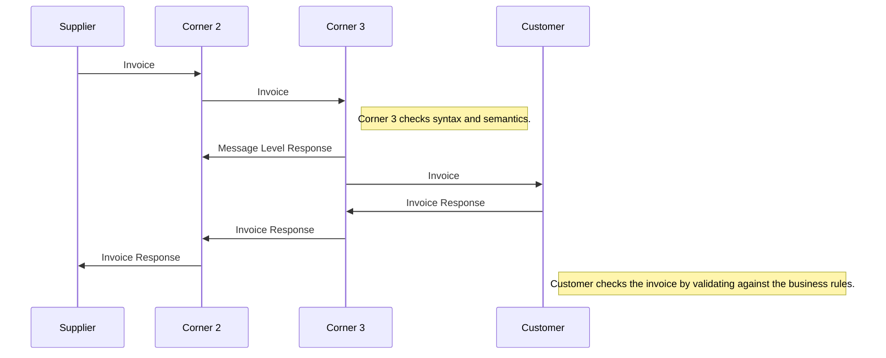
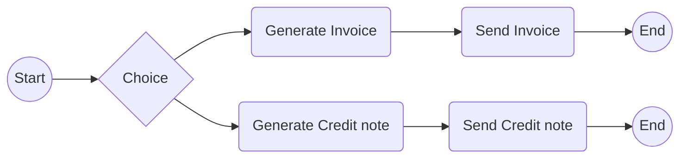
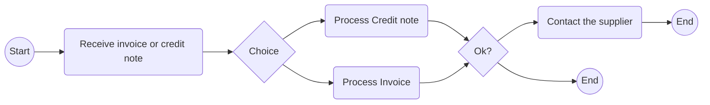

# Guideline for implementation of invoice to payment process

## 1 Introduction and briefing

The Netherlands Peppol Authority will make the implementation and use of the Message Level Response and Invoice Response part of the Dutch Peppol scheme in Q3 2021. 
This document describes the process and technical implications of the implementation of the Message Level Response and Invoice Response.

## 2 Process description

### 2.1 Invoice
The invoicing process includes issuing and sending the invoice and the credit note from the supplier to the customer and the reception and handling at the customer’s site.

* A supplier issues and sends an invoice to a customer. The invoice refers to one order and a specification of delivered goods and services.
  * An invoice may also refer to a contract or a frame agreement. 
  * The invoice may specify articles (goods and services) with article number or article description.

* A serviceprovider (corner 2) validates the invoice, wraps it in an envelope and sends the message on behalf of the supplier to the serviceprovider (corner 3) of the customer. 
* Corner 3 acknowledges the receival of the message by sending a Transport acknowledgement to corner 2.
* Corner 3 unwraps the message and validates the invoice.
* Corner 3 acknowledges or rejects the invoice based on syntactical and semantical rules.

* The customer receives the invoice and processes it in the invoice control system leading to one of the following results:
   * The customer fully approves the invoice, posts it in the accounting system and passes it on to be paid.
   * The customer completely rejects the invoice, contacts the supplier and requests a credit note.
   * The customer disputes parts of the invoice, contacts the supplier and requests a credit note and a new invoice.

The diagram below shows the basic invoicing process with the use of this PEPPOL BIS profile. 
This process assumes that both the invoice and the credit note are exchanged electronically.

### 2.2 Transport acknowledgement
These are messages that are exchanged within the transport network(s) to inform about the process of carrying a message down the transport line.
These responses may inform someone up-line that the delivery to a given point was successful or not and may contain details about issues that are relevant such as why a delivery was not successful. 
The key nature of these responses is that they do not in any way act on result of validation or processing of the content of the payload that is being transported. 
These response messages are commonly called “acks”.
Thus, unlike a Message Level Response and Invoice Response, a Transport Acknowledgement is not a document that is exchanged over the network.
The reason Transport acknowledgements are explicitly mentioned in this document is that they are a key element of the feedback cycle and therefor also of the (invoicing) process.

> For more information about how to properly use transport acknowledgements see document "Best current practices"

### 2.3 Message Level Responses
When a message has reached a given point in the transport line its content can be validated according to agreed specifications that may be both syntactical and semantic. 
The outcome of these validations should be reported to a relevant party up-line, informing him whether the validation was successful or not as well as giving some details. 
An example could be that an invoice message that is received is rejected because it is missing a closing tag (syntax error) or because its amounts don’t add up according to what is specified in the relevant syntax specification. 
A key nature of these messages is that they report on the message content on the basis of the technical specifications that apply to the message of the sender.

### 2.4 Invoice Responses
A message that has been received and accepted for processing may call for an action on the receiver’s behalf. 
That receiver’s action can be reported back up-line to a relevant party. 
An example is that a technically correct invoice may be received but the receiver decides to reject the invoice for any business reason such as an invalid Purchase Ordernumber. 
The key nature of these responses is that they report a business decision that is made on the message instance received.
We want to state clearly that any business requirements that are applied on top of the standard document business rules must have been explicitly communicated by the customer to the supplier.
This can be done by mentioning the specific requirements in a tender, in the purchase order agreement or on a publicly known webpage (for example basisfactuur Rijk).

## 3 Usage

## 4 Message definitions

The latest version of the syntax of the BIS3 Message Level Response and Invoice Response can be found on the website of OpenPeppol:
https://docs.peppol.eu/poacc/upgrade-3/syntax/MLR/tree/
https://docs.peppol.eu/poacc/upgrade-3/syntax/InvoiceResponse/tree/

In the following paragraphs you will find a detailed description the syntax and semantics for

### 4.1 Message Level Response 3.0

Field                                         | Example content                                                                                   | Cardinality   | Data type     | Explanation
---                                           | ---                                                                                               | ---           | ---           | ---
xml                                           | attributes => version="1.0" encoding="UTF-8"                                                      |               |               | 
ApplicationResponse                           | namespace =>                                                                                      | 1..1          |               | 
... cbc:CustomizationID                       | urn:fdc:peppol.eu:poacc:trns:mlr:3                                                                | 1..1          | Identifier    | 
... cbc:ProfileID                             | urn:fdc:peppol.eu:poacc:bis:mlr:3                                                                 | 1..1          | Identifier    | 
... cbc:ID                                    | Unieke identificatie transactie                                                                   | 1..1          | Identifier    | Identification of the Message Level Response. 
... cbc:IssueDate                             | 10-2-2021                                                                                         | 1..1          | Date          | Message Level Response issue date 
... cbc:IssueTime                             | 13:34:32                                                                                          | 0..1          | Time          | Message Level Response issue time
... cac:SenderParty                           |                                                                                                   | 1..1          |               | Sender information
...... cbc:EndpointID                         | [CoC number] or [OIN number] or [VAT number]                                                      | 1..1          | Identifier    | Identifies the sender party's electronic address
......... @schemeID                           | 0106 = NL:KVK  or  0190 = NL:OIN  or  9944 = NL:VAT                                               | 1..1          | attribute     | Electronic Address Scheme (f.e. 0106 or 0190)
... cac:ReceiverParty                         |                                                                                                   | 1..1          |               | Receiver of the Message Level Response
...... cbc:EndpointID                         | [CoC number] or [OIN number] or [VAT number]                                                      | 1..1          | Identifier    | Reciever party electronic address
......... @schemeID                           | 0106 = NL:KVK  or  0190 = NL:OIN  or  9944 = NL:VAT                                               | 1..1          | attribute     | Scheme identifier
... cac:DocumentResponse                      |                                                                                                   | 1..1          |               | Document response
...... cac:Response                           |                                                                                                   | 1..1          |               | Response information
......... cbc:ResponseCode                    | AB = Message acknowledgement or AP = accepted or RE = Rejected                                    | 1..1          | Identifier    | Message response code
......... cbc:Description                     | Rejected due to validation errors                                                                 | 0..1          | Identifier    | Response textual notes
...... cac:DocumentReference                  |                                                                                                   | 1..1          |               | 
......... cbc:ID                              | Reference to the envelope Message ID                                                              | 1..1          | Identifier    | Document identifier
......... cbc:DocumentTypeCode                | 380 = Commercial invoice or 381 = Credit note or 384 = Corrected invoice                          | 0..1          | Identifier    | Document type code
......... cbc:VersionID                       |                                                                                                   | 0..1          | Identifier    | Document version identifier
...... cac:LineResponse                       |                                                                                                   | 0..n          |               | Line response information
......... cac:LineReference                   |                                                                                                   | 1..1          |               | Line reference
............ cbc:LineID                       | Contains XPath to the element that causes the error. If XPath cannot be provided use NA           | 1..1          |               | Section identifier
......... cac:Response                        |                                                                                                   | 1..1          |               | Line response information
............ cbc:ResponseCode                 | AB = Message acknowledgement or AP = accepted or RE = Rejected                                    | 0..1          | Identifier    | Line response code
............ cbc:Description                  | "A buyer reference or purchase order reference MUST be provided."                                 | 1..1          | Text          | Issue description
............ cac:Status                       |                                                                                                   | 1..1          |               | Status information
............... cbc:StatusReasonCode          | "BV = fatal  or  BW = warning  or  SV = Syntax violation                                          | 1..1          |               | Issue type coded

### 4.2 Invoice Response transaction 3.1

Field                                         | Example content                                                                                   | Cardinality   | Data type     | Explanation
---                                           | ---                                                                                               | ---           | ---           | ---
xml                                           | attributes => version="1.0" encoding="UTF-8"                                                      |               |               | 
ApplicationResponse                           | namespace => xmlns="urn:oasis:names:specification:ubl:schema:xsd:ApplicationResponse-2"           | 1..1          |               | 
... cbc:CustomizationID                       | urn:fdc:peppol.eu:poacc:trns:invoice_response:3                                                   | 1..1          | Identifier    | 
... cbc:ProfileID                             | urn:fdc:peppol.eu:poacc:bis:invoice_response:3                                                    | 1..1          | Identifier    | 
... cbc:ID                                    | Unieke identificatie transactie                                                                   | 1..1          | Identifier    | Identification of the Invoice Response message. 
... cbc:IssueDate                             | 10-2-2021                                                                                         | 1..1          | Date          | Invoice Response issue date 
... cbc:IssueTime                             | 13:34:32                                                                                          | 0..1          | Time          | Invoice Response issue time
... cbc:Note                                  | Aparte toelichting is al gezonden per email                                                       | 0..1          | Text          | General comments or instructions that are relevant to the response as a whole
... cac:SenderParty                           |                                                                                                   | 1..1          |               | Afzender Invoice Response
...... cbc:EndpointID                         | 12345678                                                                                          | 1..1          | Identifier    | Identifies the sender party's electronic address
......... @schemeID                           | 0106                                                                                              | 1..1          |               | Electronic Address Scheme (f.e. 0106 or 0190)
...... cac:PartyIdentification                |                                                                                                   | 0..1          |               | Afzender identificatie
......... cbc:ID                              | 12345678                                                                                          | 1..1          | Identifier    | ID afzender
............ @schemeID                        | 0106                                                                                              | 0..1          | Identifier    | Electronic Address Scheme (f.e. 0106 or 0190)
...... cac:PartyLegalEntity                   |                                                                                                   | 1..1          |               | Afzender naam
......... cbc:RegistrationName                | Haagse administratiegroep                                                                         | 1..1          | Text          | 
...... cac:Contact                            |                                                                                                   | 0..1          |               | Contactinformatie
......... cbc:Name                            | Joop Jansen                                                                                       | 0..1          | Text          | 
......... cbc:Telephone                       | 0524 000000                                                                                       | 0..1          | Text          | 
......... cbc:ElectronicMail                  | joop@administratie9999mail.nl                                                                     | 0..1          | Text          | 
... cac:ReceiverParty                         |                                                                                                   | 1..1          |               | Ontvanger retourbericht
...... cbc:EndpointID                         |                                                                                                   | 1..1          | Identifier    | Identificatie elektronisch adres ontvanger
......... @schemeID                           | 0106                                                                                              | 1..1          | Identifier    | Identificatie elektronisch adres ontvanger SchemaID verplicht, bijvoorbeeld 0106 (KVK) of 0190 (OIN)
...... cac:PartyIdentification                |                                                                                                   | 0..1          |               | Ontvanger identificatie
......... cbc:ID                              |                                                                                                   | 1..1          |               | ID ontvanger
............ @schemeID                        | 0106                                                                                              | 0..1          | Identifier    | SchemaID optioneel, bijvoorbeeld 0106 (KVK) of 0190 (OIN)
...... cac:PartyLegalEntity                   |                                                                                                   | 1..1          |               | Afzender naam
......... cbc:RegistrationName                | Coevorden handelsbedrijf                                                                          | 1..1          | Text          | 
... cac:DocumentResponse                      |                                                                                                   | 1..1          |               | Reactie
...... cac:Response                           |                                                                                                   | 1..1          |               | 
......... cbc:ResponseCode                    | AP                                                                                                | 1..1          | Code          | Invoice status code (UNCL4343 Subset), zie toelichting
......... cbc:EffectiveDate                   | 10-2-2021                                                                                         | 0..1          | Date          | Datum waarop status actief is geworden
...... cac:Status                             |                                                                                                   | 0..N          |               | Verduidelijking is verplicht wanneer de status code UQ-Under query, RE - Rejected en CA - Conditionally Accepted is. (zie ResponseCode hiervoor). Verduidelijking kan worden gegeven in de vorm van een code, een beschrijving of beide. Als beide worden gebruikt, moeten ze dezelfde verduidelijking aangeven. Meerdere codes zijn mogelijk.
......... cbc:StatusReasonCode                | OA                                                                                                | 0..1          |               | 
............ @listID                          | OPStatusAction                                                                                    | 1..1          | Code          | Een code is mogelijk uit een tweetal codelijsten: 1. Status Clarification Reason (OpenPEPPOL), 2. Status Clarification Action (OpenPEPPOL).
......... cbc:StatusReason                    |                                                                                                   | 0..1          | Text          | 
...... cac:Condition                          |                                                                                                   | 0..N          |               | 
......... cbc:AttributeID                     |                                                                                                   | 1..1          | Code          | Vrij op te geven code. Bijv. BT-48 Buyer text number 
......... cbc:Description                     |                                                                                                   | 0..1          | Text          | Vrij op te geven tekst
...... cac:DocumentReference                  |                                                                                                   | 1..1          |               | Referentie onderliggende document. Ingeval retourbericht factuur is dit minimaal het factuurnummer.
......... cbc:ID                              | 2021932                                                                                           | 1..1          | Identifier    | Factuurnummer
......... cbc:IssueDate                       | 9-2-2021                                                                                          | 0..1          | Date          | De datum waarop de factuur waarnaar wordt verwezen, is uitgegeven. Deze datum mag maar één keer opgegeven worden.
......... cbc:DocumentTypeCode                | 380                                                                                               | 1..1          | Code          | Documenttype overeenkomstig UNCL1001. Zal in de praktijk bij een in Nederland uitgegeven factuur altijd 380 zijn. Een attentiepunt is of en hoe om te gaan met facturen uit het buitenland die bijvoorbeeld type 381 (Creditnota) hebben.
... cac:IssuerParty                           |                                                                                                   | 0..1          |               | Verkoper
...... cac:PartyIdentification                |                                                                                                   | 0..1          |               | Identificatie van de verkoper
......... cbc:ID                              |                                                                                                   | 1..1          |               | ID van de verkoper
............ @schemeID                        | 0106                                                                                              | 0..1          |               | SchemaID optioneel, bijvoorbeeld 0106 (KVK) of 0190 (OIN)
...... cac:PartyName                          |                                                                                                   | 1..1          |               | Naam van de verkoper
......... cbc:Name                            | Coevorden handelsbedrijf                                                                          | 0..1          | Text          | Naam
... cac:RecipientParty                        |                                                                                                   | 0..1          |               | Koper
...... cac:PartyIdentification                |                                                                                                   | 0..1          |               | Identificatie van de koper
......... cbc:ID                              |                                                                                                   | 1..1          | Identifier    | ID koper
............ @schemeID                        | 0106                                                                                              | 0..1          |               | SchemaID optioneel, bijvoorbeeld 0106 (KVK) of 0190 (OIN)
...... cac:PartyName                          |                                                                                                   | 1..1          |               | Naam van de koper
......... cbc:Name                            | Haagse administratiegroep                                                                         | 1..1          | Text          | Naam

## 5 Invoice scenarios

### 5.1 Accepting invoices

### 5.2 Rejecting invoices

#### 5.2.1 Syntax incorrect and/or schematron error

Transport acknowledgement > OK
Message Level Response > ResponseCode = RE
Invoice Response > Not applicable

#### 5.2.2 Unable to deliver invoice to customer

#### 5.2.3 Missing schemeID

## 6 Remarks

Remark                                        | Solved
---                                           | ---            
MLR and Invoice Response do not cover the case where communication between corner 3 and corner 4 fails (persistently). F.e. after 5 retries still no successfull delivery of message. | X
How to deal with duplicate invoice ID's in invoice response? | X
Make sending of MLR mandatory, make support of invoice response mandatory | X

